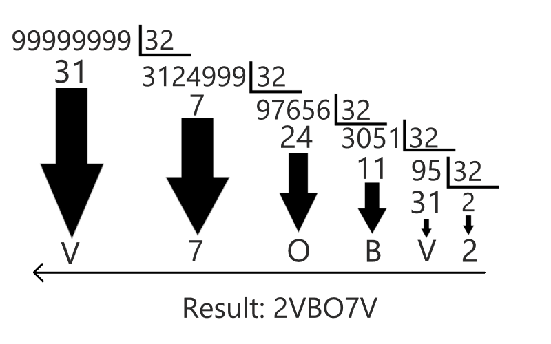
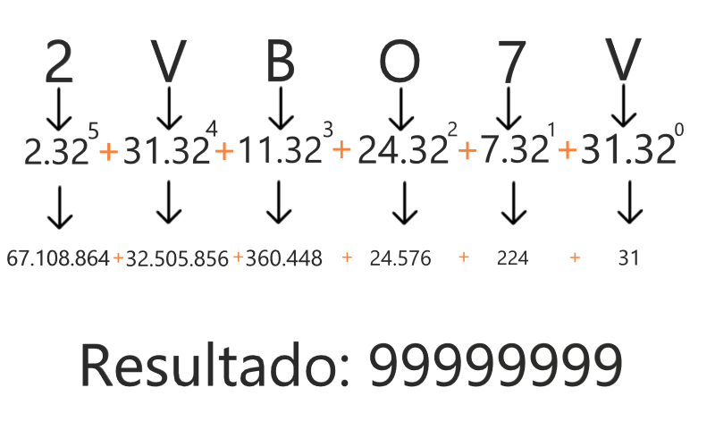

  


- [Shape Challenge](#shape-challenge)
- [The Encode Feature](#the-encode-feature)
- [The Decode Feature](#the-decode-feature)
- [How To Run Locally](#how-to-run-locally)
- [How To Run With Docker](#how-to-run-with-docker)
- [Documentation](#documentation)

# Shape Challenge
The challenge was to build an API which could receive a number, encode it, and after get the encoded value, and decode it back.
The whole solution was built with `Flask`, tested with `pytest`, and documented with `flask-restx`.

## The Encode Feature
For encoding the number in a code with fixed six characters, I chose to use base32 with the expanded hexadecimal alphabet

| Decimal | Base32(Hex-like alphabet) | Decimal | Base32(Hex-like alphabet) |
|---------|---------------------------|---------|---------------------------|
| 0       | 0                         | 16      | G                         |
| 1       | 1                         | 17      | H                         |
| 2       | 2                         | 18      | I                         |
| 3       | 3                         | 19      | J                         |
| 4       | 4                         | 20      | K                         |
| 5       | 5                         | 21      | L                         |
| 6       | 6                         | 22      | M                         |
| 7       | 7                         | 23      | N                         |
| 8       | 8                         | 24      | O                         |
| 9       | 9                         | 25      | P                         |
| 10      | A                         | 26      | Q                         |
| 11      | B                         | 27      | R                         |
| 12      | C                         | 28      | S                         |
| 13      | D                         | 29      | T                         |
| 14      | E                         | 30      | U                         |
| 15      | F                         | 31      | V                         |

On the code, I used a dictionary to handle this alphabet as a cipher:
```
_cipher = {
    0: "0",
    1: "1",
    2: "2",
    3: "3",
    4: "4",
    5: "5",
    6: "6",
    7: "7",
    8: "8",
    9: "9",
    10: "A",
    11: "B",
    12: "C",
    13: "D",
    14: "E",
    15: "F",
    16: "G",
    17: "H",
    18: "I",
    19: "J",
    20: "K",
    21: "L",
    22: "M",
    23: "N",
    24: "O",
    25: "P",
    26: "Q",
    27: "R",
    28: "S",
    29: "T",
    30: "U",
    31: "V"
}
```

So I get the number (which must have a maximum of 8 characters) and do the manual conversion from decimal to base32.  
I had to do the conversion manually because I couldn't find a way to do it properly with `python-base64` library.  
The conversions it does are from another base32 pattern, not the extended alphabet.  
For manual converting a decimal number, to a base32 we need to do like this:



Receiving `99999999` as the number, it will be encoded to `2VBO7V`

This is how this conversion looks in the code:
```
def encode(self):
    config = Config()
    encoded = ""

    module_list = []

    while self._number >= 32:
        module_list.append(self._number % 32)
        self._number //= 32

    module_list.append(self._number)

    module_list = module_list[::-1]

    for i in module_list:
        encoded += config.cipher[i]

    while len(encoded) < 6:
        encoded += "="

    return encoded
```
**OBS**: As you can see, if the code generated does not have 6 characters, it will add `=` signs until the size is filled.  

If you pass `1234` as the number, the conversion to base32 will return `16I`. So it will have 3 `=` signs at the end of the code:  

`1234 -> 16I===`

# The Decode Feature
For decoding and making the reverse path through the original number. I used the manual conversion from base32 to decimal.
It is done like this:



When receiving the `2VBO7V` as the encoded parameter, it will decode back to `99999999`  
This is how this conversion looks in the code:
```
def decode(self):
    config = Config()
    reversed_encoded = self._encoded.split("=")[0][::-1]

    key_list = list(config.cipher.keys())
    value_list = list(config.cipher.values())

    values = []
    for i in reversed_encoded:
        values.append(key_list[value_list.index(i)])

    decoded = 0
    for i, number in enumerate(values):
        decoded += number * (pow(32, i))

    return decoded
```
**OBS**: As you can see on the code. If the encoded string has the `=` signs to match the required length. The signs will be removed before the calculation starts.  

If you pass `16I===` as the code, it will be turned to `16I`, and after that decode it back to `1234`:  

`16I=== -> 1234`

## How To Run Locally
Requirements:
- [Git](https://git-scm.com/downloads)
- [Python3.10](https://www.python.org/downloads/)

1. Clone the repository  
`https://github.com/salatiel6/shape_challenge.git`


2.  Create virtual environment (recommended)  
`python -m venv ./venv`


3. Activate virtual environment (recommended)  
Windows: `venv\Scripts\activate`  
Linux/Mac: `source venv/bin/activate`


4. Open the challenge directory  
Widows/Linux:`cd shape_challenge`  
Mac: `open shape_challenge`


5. Install every dependencies  
`pip install -r requirements.txt`


6. Open the source directory  
Windows/Linux: `cd src`  
Mac: `open src`


7. Open the tests' directory (make sure to always run the tests inside its directory)  
Windows/Linux: `cd tests`  
Mac: `open tests`


8. Run tests  
Without coverage: `pytest`  
With coverage: `pytest -vv --cov=. --cov-report=term-missing --cov-config=.coveragerc`


9. Get back at `src` directory  
`cd ..`


10. Run the application  
`python run.py`


11. Check the API [Documentation](#documentation)  

## How To Run With Docker
This application was developed in a Windows OS. So I'm not sure if Linux or Mac could run the container.

Requirements:
- [Git](https://git-scm.com/downloads)
- [Docker](https://www.docker.com/)

1. Clone the repository  
`https://github.com/salatiel6/shape_challenge.git`


2. Open the challenge directory  
Widows/Linux:`cd shape_challenge`  
Mac: `open shape_challenge`


3. Build docker image  
`docker-compose build`


4. Start docker container  
`docker-compose up -d`


5. Check the API [Documentation](#documentation)


## Documentation
The both endpoints are documented on a `swagger UI`, built with `flask-restx`.  
After running the application access `http://localhost:5000/docs` to check it out.

**OBS**: Remember to check if your browser is not forcing `http` to `https`. If it happens you won't be able to access the swagger.